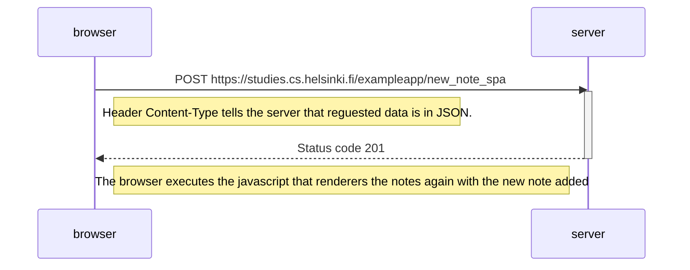

```mermaid
sequenceDiagram
    participant browser
    participant server
    
    browser->>server: POST https://studies.cs.helsinki.fi/exampleapp/new_note_spa
    activate server
    Note right of browser: Header Content-Type tells the server that reguested data is in JSON.
    server-->>browser: Status code 201
    deactivate server
    
    Note right of browser: The browser executes the javascript that renderers the notes again with the new note added


    
```
